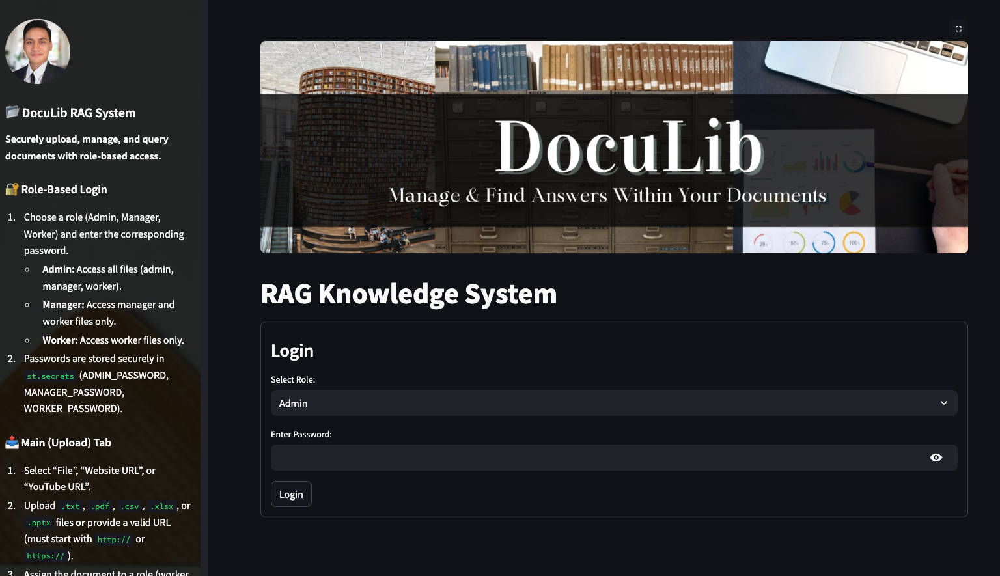
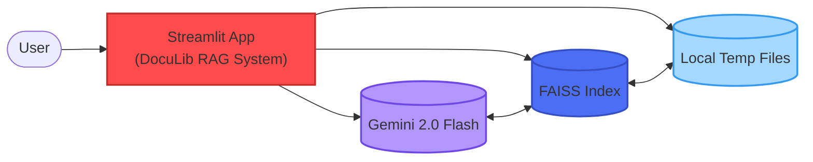
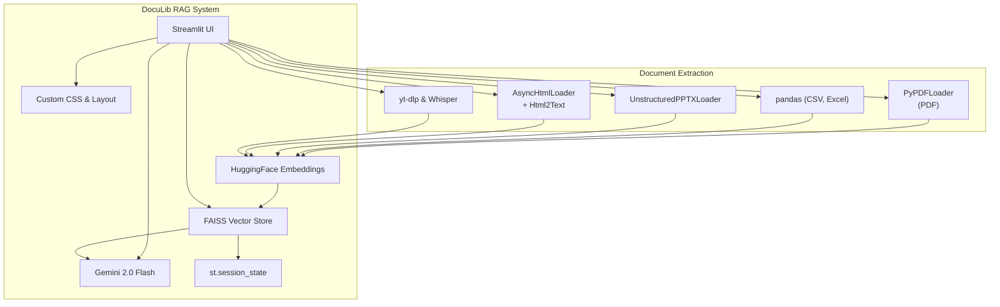

# **📂 DocuLib RAG Knowledge System**

<div align="center">
    <br>
    <a href="https://doculib-rag-app.streamlit.app/" target="_blank">https://doculib-rag-app.streamlit.app/</a>
</div>

## 

## **📄 Overview**

The **DocuLib RAG Knowledge System** is a Streamlit-based application enabling secure, role-based document upload, embedding, and question-answering over multiple file types and URLs. Users (Admin, Manager, Worker) can authenticate with passwords stored in `st.secrets`, upload documents (.txt, .pdf, .csv, .xlsx, .pptx) or index websites/YouTube videos, and query content via a FAISS vector store. Answers are generated using Google’s Gemini 2.0 Flash model. This README outlines setup, architecture, and usage.



---

## **Table of Contents**

1. [🎯 Key Features](#-key-features)
2. [🔧 Technology Stack](#-technology-stack)
3. [📝 Project Structure](#-project-structure)
4. [🚀 Getting Started](#-getting-started)
5. [🔒 Authentication & Roles](#-authentication--roles)
6. [📤 Main (Upload) Tab](#-main-upload-tab)
7. [❓ Q\&A Tab](#-qna-tab)
8. [📚 Document Library Tab](#-document-library-tab)
9. [📂 Underlying Components](#-underlying-components)
10. [🛠️ Development & Testing](#-development--testing)
11. [📚 References](#-references)
12. [📜 License](#-license)

---

## **🎯 Key Features**

* **🔐 Role-Based Access Control**

  * Three roles: **Admin**, **Manager**, **Worker**.
  * Passwords stored securely in `st.secrets` (ADMIN\_PASSWORD, MANAGER\_PASSWORD, WORKER\_PASSWORD).
  * Role dictates which documents a user can upload and query.

* **📤 Flexible Document & URL Ingestion**

  * Upload `.txt`, `.pdf`, `.csv`, `.xlsx`, `.pptx`.
  * Index website URLs via `AsyncHtmlLoader` → `Html2TextTransformer`.
  * Index YouTube videos via `yt-dlp` + OpenAI Whisper transcription.
  * File handlers extract text (chunked \~500 words) for FAISS indexing.

* **🤖 Semantic Search & Answer Generation**

  * FAISS vector store powered by `sentence-transformers/all-MiniLM-L6-v2` embeddings.
  * Gemini 2.0 Flash for concise, contextual answers (50–75 words).
  * Top-3 relevant chunks retrieved and filtered by role.

* **📚 Document Library & Downloads**

  * Table of accessible documents per user role.
  * On-the-fly download buttons for stored file binaries.

* **🎨 Custom UI & Styling**

  * Custom CSS for sidebar background, overlay, and buttons.
  * Page configured with wide layout, custom favicon, and header image.

---

## **🔧 Technology Stack**




---

## **📝 Project Structure**

```plaintext
.
├── assets/
│   ├── DocuLib_Background.png   # Main page background
│   ├── RAG_LLM_Pic.jpg          # Favicon / app icon
│   └── doc_background.jpg       # Sidebar background image
├── images/
│   └── app_image.png            # README screenshot
├── main.py                      # Streamlit application entry point
├── component/
│   └── page_style.py            # Custom CSS and page configuration
├── requirements.txt             # Python dependencies
├── README.md                    # Project documentation (this file)
└── .streamlit/
    └── secrets.toml             # Passwords & API keys (not in repo)
```

---

## **🚀 Getting Started**

1. **Clone the Repository**

   ```bash
   git clone https://github.com/fahmizainal17/DocuLib_RAG_System.git
   cd DocuLib_RAG_System
   ```

2. **Create & Activate Virtual Environment**

   ```bash
   python -m venv venv
   source venv/bin/activate  # On Windows: venv\Scripts\activate
   ```

3. **Install Dependencies**

   ```bash
   pip install -r requirements.txt
   ```

4. **Configure Secrets**

   * In `.streamlit/secrets.toml`, add:

     ```toml
     HF_TOKEN = "<YOUR_HUGGINGFACE_TOKEN>"
     GEMINI_API_KEY = "<YOUR_GEMINI_API_KEY>"
     OPENAI_TRANSCRIPTION_API_KEY = "<YOUR_OPENAI_WHISPER_KEY>"
     ADMIN_PASSWORD = "<ADMIN_PASSWORD>"
     MANAGER_PASSWORD = "<MANAGER_PASSWORD>"
     WORKER_PASSWORD = "<WORKER_PASSWORD>"
     ```
   * **Important**: Do not commit `secrets.toml` to source control.

5. **Run the App**

   ```bash
   streamlit run main.py
   ```

6. **Access in Browser**
   Navigate to `http://localhost:8501`.
   Log in using one of the three roles and corresponding password.

---

## **🔒 Authentication & Roles**

Upon launch, users must select a role and enter the matching password:

* **Admin**

  * Password: `ADMIN_PASSWORD` (in `st.secrets`)
  * Full access to all documents: tags “admin”, “manager”, “worker”.

* **Manager**

  * Password: `MANAGER_PASSWORD`
  * Access to documents tagged “manager” and “worker”.

* **Worker**

  * Password: `WORKER_PASSWORD`
  * Access only to documents tagged “worker”.

If authentication fails, the app displays an error. Successful login reveals the three main tabs.

---

## **📤 Main (Upload) Tab**

1. **Header & Clear Embeddings**

   * Click **“Clear Embeddings”** to wipe the existing FAISS index and uploaded document list.

2. **Select Input Type**

   * **File**: Upload a local `.txt`, `.pdf`, `.csv`, `.xlsx`, or `.pptx`.

     * PDF → `PyPDFLoader` → extract text.
     * CSV/Excel → `pandas` → concatenate cells.
     * PPTX → `UnstructuredPowerPointLoader` → extract slides.

   * **Website URL**: Paste a URL starting with `http://` or `https://`.

     * Validated by prefix.
     * Uses `AsyncHtmlLoader` + `Html2TextTransformer` to extract content.

   * **YouTube URL**: Paste a YouTube link.

     * Validated to contain `youtube.com` or `youtu.be`.
     * Uses `yt-dlp` to download audio → OpenAI Whisper for transcription.

3. **Assign Access Role**

   * Choose from `worker` / `manager` / `admin`.
   * Click “Upload and Index” (for files) or “Index URL” (for web/YouTube).
   * The file or transcript is chunked (\~500 words), converted to embeddings, and added to FAISS.
   * Session state `uploaded_docs` is updated with:

     ```json
     {
       "doc_id": "file_1",
       "filename": "example.pdf",
       "path": "/tmp/tmpabcd1234",
       "role": "worker",
       "type": "pdf",
       "file_data": <bytes>
     }
     ```
   * **Success**: Displays confirmation and stores file binary in session for downloads.

---

## **❓ Q\&A Tab**

1. **Ask a Question**

   * Input a natural language question.
   * Click **“Get Answer”**.

2. **Retrieve Relevant Chunks**

   * The function `search_vectorstore(question, top_k=3)` performs:

     * `similarity_search` on FAISS to fetch top-k chunks.
     * Filters by `uploaded_docs` and the user’s role → ensures only accessible chunks.
     * Concatenates chunk contents separated by `"\n---\n"`.

3. **Generate Answer with Gemini**

   * `generate_answer_with_gemini(question, context)` uses the ChatPrompt:

     ```
     Based on the following information, provide a concise answer to the question:

     Information:
     {context}

     Question: {question}

     You must answer in the language of the question (e.g., English if in English, Malay if in Malay).
     Answer concisely in 50-75 words:
     ```
   * Send prompt to `gemini_model.generate_content`.
   * Display output under **“Answer:”**.

4. **No Context Found**

   * If no chunks match, a warning: “No relevant context found. Try uploading more documents.”

---

## **📚 Document Library Tab**

1. **List Accessible Documents**

   * Filters `st.session_state.uploaded_docs` by:

     ```python
     allowed_roles = {
         "admin": ["admin", "manager", "worker"],
         "manager": ["manager", "worker"],
         "worker": ["worker"]
     }
     accessible_roles = allowed_roles.get(current_role, [])
     docs = [
         doc for doc in uploaded_docs
         if doc["role"] in accessible_roles
     ]
     ```
   * If `docs` is empty → displays “No documents available for your role.”

2. **Display Table**

   * Columns:

     * **No** (index starting from 1)
     * **Filename/URL**
     * **Role**
     * **Type** (PDF, TXT, CSV, XLSX, PPTX, Website URL, YouTube URL).

3. **Download Buttons**

   * For each document with `file_data` (i.e., actual file uploads, not URLs), render:

     ```python
     st.download_button(
         label=f"Download {doc['filename']}",
         data=doc["file_data"],
         file_name=doc["filename"],
         key=f"dl_{doc['filename']}"
     )
     ```

---

## **📂 Underlying Components**

### 1. **FAISS Vector Store Initialization**

```python
FAISS_DIR = "faiss_index"
if "vectorstore" not in st.session_state:
    if os.path.isdir(FAISS_DIR):
        vs = FAISS.load_local(FAISS_DIR, embedding_model, allow_dangerous_deserialization=True)
    else:
        from langchain_community.docstore.in_memory import InMemoryDocstore
        embedding_dim = len(embedding_model.embed_query("test"))
        index = faiss.IndexFlatL2(embedding_dim)
        vs = FAISS(
            embedding_function=embedding_model,
            index=index,
            docstore=InMemoryDocstore(),
            index_to_docstore_id={}
        )
        vs.save_local(FAISS_DIR)
    st.session_state.vectorstore = vs
```

* On first run:

  * Checks if `faiss_index/` exists.
  * If yes → loads existing index.
  * Otherwise → creates new `FAISS` with `InMemoryDocstore`.
  * Embeddings: `sentence-transformers/all-MiniLM-L6-v2`.

### 2. **Chunking Function**

```python
def chunk_text(text: str, max_words: int = 500) -> list[tuple[int, str]]:
    sentences = text.split(". ")
    chunks, current, idx = [], "", 0
    for sent in sentences:
        if len(current.split()) + len(sent.split()) > max_words:
            chunks.append((idx, current.strip()))
            idx += 1
            current = sent + ". "
        else:
            current += sent + ". "
    if current.strip():
        chunks.append((idx, current.strip()))
    return chunks
```

* Splits text into \~500-word segments.
* Returns list of `(chunk_index, chunk_text)`.

### 3. **Indexing a Document**

```python
def index_document_in_vectorstore(doc_id: str, text: str):
    chunks = chunk_text(text)
    documents = [
        Document(page_content=chunk, metadata={"doc_id": doc_id, "chunk_index": idx})
        for idx, chunk in chunks
    ]
    if documents:
        st.session_state.vectorstore.add_documents(documents)
        st.session_state.vectorstore.save_local(FAISS_DIR)
```

* Converts each chunk to a `langchain.schema.Document`.
* Adds to FAISS and persists locally.

### 4. **File-Type Handlers**

* **PDF**:

  ```python
  loader = PyPDFLoader(file_path, extract_images=True)
  pages = loader.load()
  text = " ".join(page.page_content for page in pages)
  ```
* **CSV**:

  ```python
  df = pd.read_csv(file_path)
  text = " ".join(df.astype(str).apply(lambda row: " ".join(row.values), axis=1))
  ```
* **Excel**:

  ```python
  df = pd.read_excel(file_path, engine="openpyxl")
  text = " ".join(df.astype(str).apply(lambda row: " ".join(row.values), axis=1))
  ```
* **PowerPoint**:

  ```python
  loader = UnstructuredPowerPointLoader(file_path, mode="elements")
  pages = loader.load()
  text = " ".join(page.page_content for page in pages)
  ```
* **Website URL**:

  ```python
  loader = AsyncHtmlLoader([url])
  docs = loader.load()
  html2text = Html2TextTransformer()
  docs_transformed = html2text.transform_documents(docs)
  text = docs_transformed[0].page_content
  ```
* **YouTube URL**:

  ```python
  with tempfile.NamedTemporaryFile(delete=False, suffix=".mp3") as tmp_audio:
      ydl_opts = {
          'format': 'bestaudio/best',
          'postprocessors': [{'key': 'FFmpegExtractAudio','preferredcodec': 'mp3','preferredquality': '192'}],
          'outtmpl': tmp_audio.name.replace(".mp3", ""),
          'quiet': True,
      }
      with yt_dlp.YoutubeDL(ydl_opts) as ydl:
          ydl.download([url])
      with open(tmp_audio.name, "rb") as audio_file:
          transcript = openai_client.audio.transcriptions.create(model="whisper-1", file=audio_file)
      text = transcript.text
      cleanup_temp_file(tmp_audio.name)
  ```

---

## **🛠️ Development & Testing**

1. **Install Development Dependencies**

   ```bash
   pip install -r requirements.txt
   ```

2. **Run Local Linter**

   ```bash
   flake8 .
   ```

3. **Run Unit Tests (if any)**

   ```bash
   pytest tests/ -v
   ```

4. **Streamlit Debug Mode**

   * Use `streamlit run main.py --server.runOnSave true` for auto-reload.

5. **Filesystem Cleanup**

   * Temporary files created for uploaded documents and audio chunks are deleted via `cleanup_temp_file(...)` after processing.

---

## **📚 References**

* [Streamlit Documentation](https://docs.streamlit.io/)
* [LangChain FAISS Integration](https://python.langchain.com/en/latest/modules/indexes/vectorstores/examples/faiss.html)
* [Google Gemini API (Flash)](https://developers.generativeai.google)
* [OpenAI Whisper API](https://platform.openai.com/docs/guides/speech-to-text)
* [yt-dlp Repository](https://github.com/yt-dlp/yt-dlp)
* [PyPDFLoader (LangChain)](https://python.langchain.com/en/latest/modules/document_loaders/external/pdf.html)
* [AsyncHtmlLoader & Html2TextTransformer](https://python.langchain.com/en/latest/modules/document_loaders/external/html.html)

---

## **📜 License**

Fahmi Zainal Custom License
Unauthorized copying, distribution, or modification of this project is prohibited. For licensing inquiries, contact the project maintainers.

---

*Last updated: June 2025*
